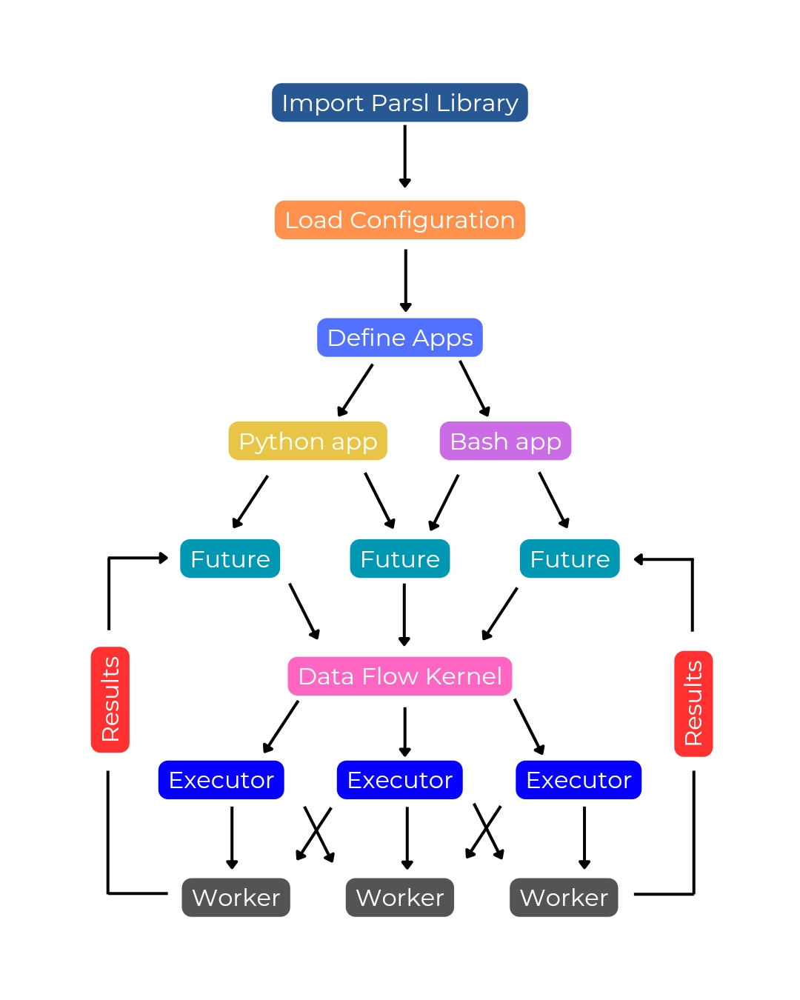

1. Getting Started with Parsl
^^^^^^^^^^^^^^^^^^^^^^^^^^^^^^^^^^^^^

Installation and Setup
-----------------------

System Requirements and Dependencies
~~~~~~~~~~~~~~~~~~~~~~~~~~~~~~~~~~~~~~

Parsl is compatible with Python 3.8 or newer. It has been tested on Linux. To install Parsl, you must have Python and pip (Python's package installer) on your system.

Windows OS
^^^^^^^^^^

While Parsl is not officially supported on Windows yet, you can install and run it using the `Windows Subsystem for Linux (WSL) <https://learn.microsoft.com/en-us/windows/wsl/install>`__, which allows you to run a Linux environment directly on Windows. If you want to lead the development of Windows OS support for Parsl, please participate in this issue: `Parsl Issue 1878 <https://github.com/Parsl/parsl/issues/1878>`__.

To install Parsl in WSL, follow these steps:

1. Enable WSL: Open PowerShell as Administrator and run: ``dism.exe /online /enable-feature /featurename:Microsoft-Windows-Subsystem-Linux /all /norestart``
2. Install a Linux distribution: Download a Linux distribution (e.g., Ubuntu).
3. Open the Linux terminal: Once installed, search for "WSL" in the Start menu and select your Linux distribution.
4. Update and upgrade packages: In the terminal, run: ``sudo apt update && sudo apt upgrade``
5. Install Python and pip: Run: ``sudo apt install python3 python3-pip``
6. Install Parsl: Run: ``python3 -m pip install parsl``

Docker
^^^^^^

Docker is a platform for developing, shipping, and running applications in containers. You can use Docker to create a portable Parsl environment that can run on any system with Docker installed.

To install Parsl in Docker, follow these steps:

1. Install Docker: Download and install Docker Desktop for your operating system.
2. Pull the Parsl image: In a terminal or command prompt, run: ``docker pull parsl/parsl``
3. Run a Parsl container: Run: ``docker run -it parsl/parsl bash`` This will start a Bash shell inside the Parsl container.
4. Use Parsl: You can now run Parsl commands inside the container.

MacOS
^^^^^

Parsl can be installed on macOS using pip or conda. If you use a Mac with an M1 chip, you may need to install Parsl in a Rosetta terminal to ensure compatibility with the required libraries.

Open a Rosetta terminal by going to ``/Applications/Utilities/Terminal`` in Finder, right-clicking on Terminal, and selecting "Duplicate." Then, right-click on the duplicated Terminal and select "Get Info". In the Info window, check the "Open using Rosetta" checkbox.

Linux
^^^^^

Parsl is well-supported on Linux and can be installed using pip or conda. You can access the terminal by searching for "terminal" in your applications menu or by pressing Ctrl+Alt+T.

Android
^^^^^^^

Parsl is not designed to run on Android devices directly. However, there are workarounds, such as using online platforms like Google Colaboratory to run Parsl scripts in a web browser environment. These platforms provide a Jupyter Notebook interface where you can write and execute Parsl code.

Installing Parsl
-----------------

You can easily install Parsl using pip:

.. code-block:: bash

   python3 -m pip install parsl

To check if it is installed correctly, run the following command in your terminal or command prompt:

.. code-block:: bash

   parsl --version

If Parsl is installed, this command will print the version number. If you get an error, double-check that Python and pip are installed correctly.

To upgrade Parsl to the latest version, use:

.. code-block:: bash

   python3 -m pip install -U parsl

If you are using the conda package manager, you can install Parsl from the conda-forge channel:

.. code-block:: bash

   conda config --add channels conda-forge
   conda install parsl

Common Errors
~~~~~~~~~~~~~~~

Here are some common errors you might encounter during installation and how to fix them:

- Dependency errors: Parsl has several dependencies, such as pyzmq, dill, and globus-sdk. If you encounter errors related to these dependencies, try installing them manually using pip. For example: ``python3 -m pip install pyzmq dill globus-sdk``
- ERROR: Could not find a version that satisfies the requirement parsl: This means that pip cannot find a compatible version of Parsl for your Python version. Make sure you are using Python 3.8 or newer.
- ModuleNotFoundError: No module named 'parsl': This means that Parsl is not installed. Make sure you have followed the installation instructions correctly.
- Permission errors: If you get permission errors during installation, try running the pip command with sudo (Linux/macOS) or as an administrator (Windows).

If you encounter other errors, please consult the Parsl documentation or seek help from the Parsl community in the ``#parsl-help`` channel in Slack.

Basic Configuration
--------------------

Parsl separates your code (the tasks you want to run) from how it's executed (where and how those tasks run). This is done through a configuration file that tells Parsl how to use your computing resources.

A simple configuration for running Parsl on your local machine might look like this:

.. code-block:: python

   from parsl.config import Config
   from parsl.executors import ThreadPoolExecutor

   config = Config(
       executors=[ThreadPoolExecutor(max_threads=4)]
   )

This configuration tells Parsl to use your local machine's resources and run tasks using up to 4 threads in parallel.

First Steps
------------

Writing a Parsl Script
~~~~~~~~~~~~~~~~~~~~~~

A Parsl script is a Python script that defines the tasks you want to run in parallel and how they depend on each other.

Here's a simple example:

.. code-block:: python

   !pip install parsl
   import parsl
   from parsl.config import Config
   from parsl.executors import HighThroughputExecutor

   # Configure Parsl (Local Threads)
   config = Config(executors=[HighThroughputExecutor(max_workers=4)]) # Use 4 threads
   parsl.load(config)

.. code-block:: python

   import parsl
   from parsl import python_app

   @python_app
   def my_task(x):
       return x * 2

   results = []
   for i in range(10):
       results.append(my_task(i))

   # Indent the following block to be part of the 'for' loop
   for result in results:
       print(result.result())

These scripts define a task called ``my_task`` that doubles a number. Run the first and then the second (top to bottom). It then creates 10 instances of this task, each with a different input, and runs them in parallel. Finally, it prints the results as they become available. To check if this script worked, you should see the numbers 0 through 18 printed to your console, although not necessarily in order.

Parsl Script Basic Workflow
---------------------------

1. Import Parsl: The script begins by importing the Parsl library, which provides the necessary tools and functions for parallel execution.
2. Load Configuration: A configuration object is loaded, specifying the resources (e.g., local threads, clusters, clouds) that Parsl will use to execute tasks. This step is crucial as it tailors Parsl's behavior to the specific computing environment.
3. Define Apps: Python functions are decorated with special tags (@python_app or @bash_app) to indicate that they can be run in parallel as independent tasks.
4. Call Apps: The decorated functions (apps) are invoked, creating futures. Futures are placeholders for the results of these parallel tasks, allowing the script to continue without waiting for each task to finish.
5. DataFlowKernel (DFK): The DFK, the core of Parsl, takes over. It manages the execution of tasks, ensuring they run when their dependencies (e.g., input data) are ready and resources are available.
6. Task Execution: The DFK sends tasks to executors, which are responsible for running the tasks on the specified resources (e.g., different cores or nodes).
7. Get Results: Once tasks are completed, the ``.result()`` method is used to retrieve the results from the futures. The script can then use these results for further processing or analysis.
8. End: The script concludes after all tasks have been executed and their results have been retrieved.

To run a Parsl script, you first need to load the configuration:

.. code-block:: python

   parsl.load(config)

This tells Parsl how to execute the tasks in your script. Once the configuration is loaded, you can run your script like any other Python script.

Practical Tutorial: Hello World with Parsl
------------------------------------------

Let's look at a more practical example:

.. code-block:: python

   import parsl
   from parsl import python_app

   # Define a Parsl app (a function that can run in parallel)
   @python_app
   def hello():
       return "Hello Frodo!"

   # Run the app and get the result
   result = hello().result()
   print(result)  # Output: Hello, Frodo!

This script defines a Parsl app called ``hello`` that takes a name and returns a greeting. It then runs the app with the input "Frodo" and prints the result. If this script worked, you should see "Hello, Frodo!" printed to your console.

Glossary of Terms
-----------------

- App: A Python function decorated with ``@python_app`` or ``@bash_app`` that tells Parsl it can be run in parallel.
- AppFuture: A future that represents the execution of a Parsl app.
- Block: A group of resources used by Parsl.
- Concurrency: The ability of a program to handle multiple tasks at once.
- DataFlowKernel (DFK): The part of Parsl that manages the execution of your apps and the flow of data between them.
- DataFuture: A future that represents a file produced by a Parsl app.
- Elasticity: The ability of Parsl to dynamically adjust how many blocks it uses.
- Execution Provider: A component that connects Parsl to computing resources.
- Executor: The part of Parsl that runs your apps on different computers or processors.
- Future: A placeholder for the result of a task that hasn't finished yet. You can use the ``.result()`` method to get the actual result when it's ready.
- Launcher: A component that starts worker processes to execute tasks.
- Thread: A lightweight process that allows for concurrent execution of tasks within a single program.

